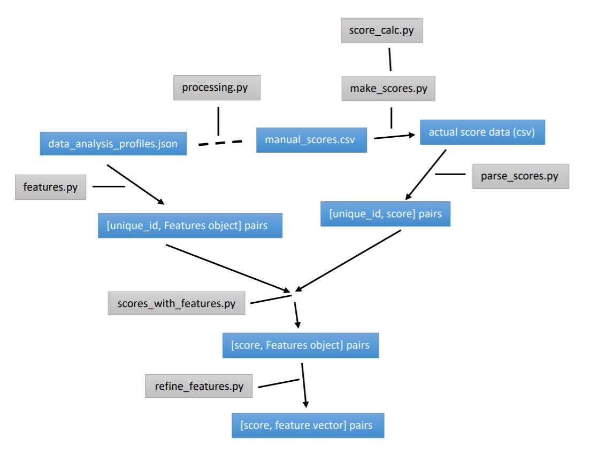

# Project Structure

## Runnable Files:
- processing.py
- make_scores.py
- analysis files:
  - analysis_old.py
  - avg_score_by_exp.py
  - score_histograms.py
  - report_code.ipynb
  - tree_and_forest.py
## Modules:
 - helpers.py
 - plot.py
 - score_calc.py
 - features.py
 - parse_scores.py
 - scores_with_features.py
 - refine_features.py
 ## Subdirectories:
- graphs:
  - may be empty
- score_data:
  - data_analysis_profiles.json
- profile_data:
  - annotations_AF.csv
  - annotations_AF_new.csv
  - annotations_200+.csv
  - annotations_200+_new.csv
  - annotations.csv
  - manual_scores.csv
  
# Data Pipline Visualized

The stages of the pipeline are denoted by the blue rectangles. The python modules are used to transform data from one stage of the pipeline to the next. The data pipeline starts starts off with the raw profile data. The dotted line to the right indicates that a human uses the printed output from processing.py to manually input data into a csv. The only modules not shown in this diagram are helpers.py and plot.py which contain general and plot-related helper functions respectively that are used in various stages of the pipeline.

At the very end of the pipeline we see the (score, feature vector) pairs that will be used for generating training decision trees in 'tree_and_forest.py'. Such analysis files are used to make observations at various stages of the pipeline.

# Runnable File Usage
First, ensure you have all the listed python files and the three listed subdirectories all in a single directory.

## Using processing.py
Next, run:

> python -i processing.py

then type:

> print_person_new(1)

This function prints out the relevant data from a profile (the nth profile in 'data_analysis_profiles.json') in a human-readable format. You can also print the next person with:

> next()

## Using make_scores.py

Before running any of the analysis files, you must first run:

> python make_scores.py

which will generate the file 'score_data/franco_scores.csv' ('actual score data (csv)' in the pipeline diagram).

The provided file 'score_data/manual_scores.csv' contains the manually inputted scores for each experience of each of the first 1000 profiles in 'profile_data/data_analysis_profiles.json' in addition to the scores for the 'high importance' and 'low importance' time-invariant fields for each of those profiles. However, these are not the actual scores we will use for training. 'make_scores.py' uses the data in 'score_data/manual_scores.csv' to generate the actual scores and stores them in the file 'score_data/franco_scores.csv'. The module 'score_calc.py' is used in 'make_scores.py' to combine experience scores and time-invariant scores into a single, final score. The other modules and analyses reference 'score_data/franco_scores.csv' frequently, so 'make_scores.py' must be run first. This file can be run again to update 'score_data/franco_scores.csv' in the event that the method to calculate the final score (located in score_calc.py) changes.

## Using the Analysis Files

### analysis_old.py
This analysis operates on the 'actual score data' stage of the pipeline and compares score data from three different files.
To execute run:
> python analysis_old.py

### avg_score_by_exp.py
This analysis also operates on the 'actual score data' stage. It calculates the average score given the number of experiences of an individual, and displays the data in a scatter plot. It does this for each valid file in the profile_data subdirectory (currently 6 in total).
To execute, run:
> python avg_score_by_exp.py

### score_histograms.py
This analysis operates on the '[score, Features object] pairs' stage of the pipeline. This creates a histograms of scores with the score data in 'score_data/franco_scores.csv'. It also allows for various filters to be placed on the data to make a histogram out of a specified subset of the scores. It can also be used to find the most popular skills, industries, faculties, and majors (again, with optional additional filters). Additional comments for how to modify the filters are included in the file itself.
To execute, run:
> python score_histograms.py

### report_code.ipynb
This analysis operates on the '[score, feature vector] pairs' stage of the pipeline. To run this code open up the python notebook and run all the cells sequentially. This will generate all the data and graphs included in my report. CSVs containing the data for some of the tables will be sent to the graphs subdirectory upon execution. See my report for a more detailed description of this code.

### tree_and_forest.py
This analysis operates on the '[score, feature vector] pairs' stage of the pipeline. Here we generate the decision tree and the random forest classifiers using training data and compare their accuracy on validation data. A visualization of the decision tree is sent to the graphs subdirectory.
